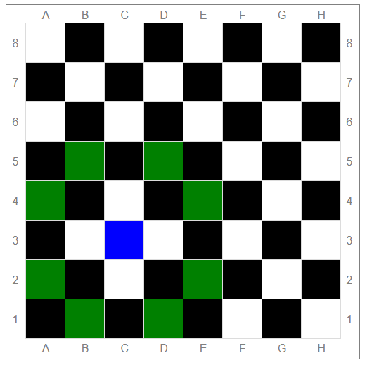

ссылка на GitHub Pages: https://sergeykorolov.github.io/KnightMove2D/

Страница содержащая изображение шахматной доски, 
при клике по клеткам которой возможные варианты ходов конем из этой клетки подсвечиваются цветом.

Вид страницы при щелчке по клетке C3:

